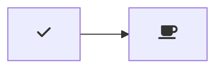

```mermaid
architecture-beta
    service user(mdi:account)
    service lambda(logos:aws-lambda)

    user:R --> L:lambda
```

# Markdown Preview Mermaid Support

[](https://marketplace.visualstudio.com/items?itemName=bierner.markdown-mermaid)

Adds [Mermaid](https://mermaid-js.github.io/mermaid/#/) diagram and flowchart support to VS Code's builtin Markdown preview and to Markdown cells in notebooks.


Currently supports Mermaid version 11.12.0.

## Usage

Create diagrams in markdown using `mermaid` fenced code blocks:

~~~markdown

~~~

### Zoom, Pan, and Reset

All rendered Mermaid diagrams are interactive:

* **Zoom** – Hold <kbd>Ctrl</kbd> (or <kbd>⌘</kbd> on macOS) and scroll the mouse-wheel to zoom in or out at the cursor position.
* **Pan** – Hold <kbd>Ctrl</kbd> and drag with the **left** mouse button to move the diagram when zoomed.
* **Reset** – Hold <kbd>Ctrl</kbd> and click the **right** mouse button to return to the default view.

These shortcuts only affect the diagram container; normal scrolling and text selection behave as usual.

You can also use `:::` blocks:

```markdown
::: mermaid
graph TD;
    A-->B;
    A-->C;
    B-->D;
    C-->D;
:::
```

Supports [MDI](https://icon-sets.iconify.design/mdi/) and [logos](https://icon-sets.iconify.design/logos/) icons from Iconify:

~~~markdown

~~~


## Configuration

### Theme Settings

- `markdown-mermaid.lightModeTheme` — Configures the Mermaid theme used when VS Code is using a light color theme. Supported values are: `"base"`, `"forest"`, `"dark"`, `"default"`, `"neutral"`. Currently not supported in notebooks.

- `markdown-mermaid.darkModeTheme` — Configures the Mermaid theme used when VS Code is using a dark color theme. Supported values are: `"base"`, `"forest"`, `"dark"`, `"default"`, `"neutral"`. Currently not supported in notebooks.

- `markdown-mermaid.languages` — Configures language ids for Mermaid code blocks. The default is `["mermaid"]`.

### Zoom and Pan Settings

**Accessing Settings:**
1. Open VS Code Settings: `Ctrl+,` (Windows/Linux) or `Cmd+,` (macOS)
2. Search for: `markdown mermaid`
3. Find the "Zoom and Pan" options

**Available Settings:**

- `markdown-mermaid.enableZoomPan` — Enable or disable zoom and pan functionality for Mermaid diagrams. Default is `true`.

- `markdown-mermaid.minZoom` — Minimum zoom level. Default is `0.2` (20%).

- `markdown-mermaid.maxZoom` — Maximum zoom level. Default is `10` (1000%).

- `markdown-mermaid.zoomStep` — Zoom step per scroll tick as a fraction of the current zoom level. Default is `0.25` (25%). For example, at 1x zoom, each scroll will change zoom by 25%, but at 2x zoom, each scroll will change by 50%.

**Example:**

To restrict zoom range and make zoom changes more gradual, add to your VS Code settings:

```json
{
  "markdown-mermaid.enableZoomPan": true,
  "markdown-mermaid.minZoom": 0.5,
  "markdown-mermaid.maxZoom": 5,
  "markdown-mermaid.zoomStep": 0.1
}
```

**Note:** Changes to these settings require reloading the VS Code window to take effect.

### Using custom CSS in the Markdown Preview

You can use the built-in functionality to add custom CSS. More info can be found in the [markdown.styles documentation](https://code.visualstudio.com/Docs/languages/markdown#_using-your-own-css)

For example, add Font Awesome like this:

```
"markdown.styles": [
    "https://use.fontawesome.com/releases/v5.7.1/css/all.css"
]
```

Use it like this:

~~~markdown

~~~
