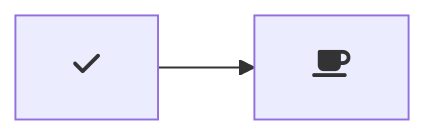

# Markdown Preview Mermaid Support

[](https://marketplace.visualstudio.com/items?itemName=bierner.markdown-mermaid)

Adds [Mermaid](https://mermaid-js.github.io/mermaid/#/) diagram and flowchart support to VS Code's builtin Markdown preview and to Markdown cells in notebooks.


Currently supports Mermaid version 10.0.2.

## Usage

Create diagrams in markdown using `mermaid` fenced code blocks:

~~~markdown

~~~

You can also use `:::` blocks:

```markdown
::: mermaid
graph TD;
    A-->B;
    A-->C;
    B-->D;
    C-->D;
:::
```


## Configuration

- `markdown-mermaid.lightModeTheme` — Configures the Mermaid theme used when VS Code is using a light color theme. Supported values are: `"base"`, `"forest"`, `"dark"`, `"default"`, `"neutral"`. Currently not supported in notebooks.

- `markdown-mermaid.darkModeTheme` — Configures the Mermaid theme used when VS Code is using a dark color theme. Supported values are: `"base"`, `"forest"`, `"dark"`, `"default"`, `"neutral"`. Currently not supported in notebooks.

- `markdown-mermaid.languages` — Configures language ids for Mermaid code blocks. The default is `["mermaid"]`.

### Using custom CSS in the Markdown Preview

You can use the built-in functionality to add custom CSS. More info can be found in the [markdown.styles documentation](https://code.visualstudio.com/Docs/languages/markdown#_using-your-own-css)

For example, add Font Awesome like this:

```
"markdown.styles": [
    "https://use.fontawesome.com/releases/v5.7.1/css/all.css"
]
```

Use it like this:

~~~markdown

~~~
