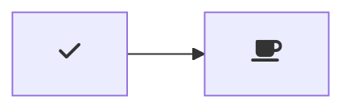

# Markdown Preview Mermaid Support

Adds Mermaid diagram and flowchart support to VS Code's builtin markdown preview

## Usage

Create diagrams in markdown using `mermaid` code blocks:

~~~markdown

~~~

## Mermaid

Currently supporting Mermaid version 8.4.0.

## Add custom CSS support

You can use the built-in functionality to add custom CSS.

For example: **Font Awesome**  
To use Font Awesome, you can simply add it to your visual studio code settings for markdown. You can add it for the current workspace only, or globally.
- Open the command pallette
- Type `settings`
- Select either the user or workspace settings
- Search for the markdown section, and within this section go to `styles`
- Press `Add item`
- Insert `https://use.fontawesome.com/releases/v5.7.1/css/all.css`
- Press `Ok`
- All done. Give it a try

~~~markdown

~~~
