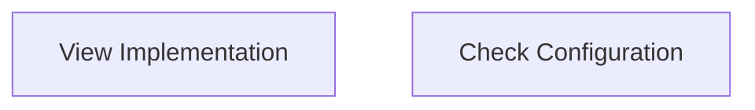
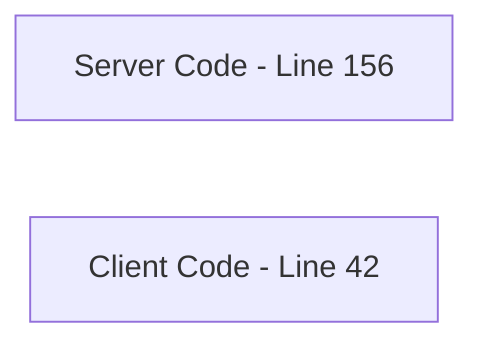
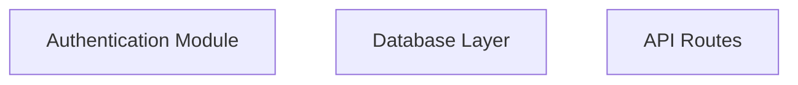
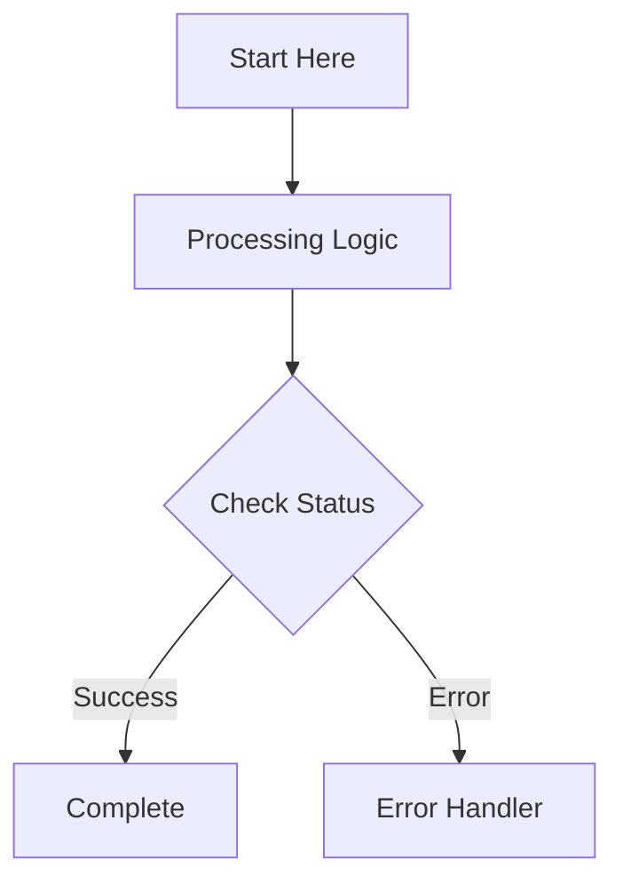
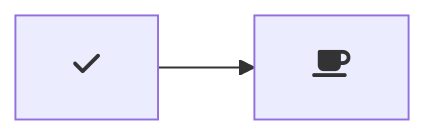

```mermaid
architecture-beta
    service user(mdi:account)
    service lambda(logos:aws-lambda)

    user:R --> L:lambda
```

# Markdown Preview Mermaid Support

[](https://marketplace.visualstudio.com/items?itemName=bierner.markdown-mermaid)

Adds [Mermaid](https://mermaid-js.github.io/mermaid/#/) diagram and flowchart support to VS Code's builtin Markdown preview and to Markdown cells in notebooks.


Currently supports Mermaid version 11.12.0.

## Usage

Create diagrams in markdown using `mermaid` fenced code blocks:

~~~markdown

~~~

You can also use `:::` blocks:

```markdown
::: mermaid
graph TD;
    A-->B;
    A-->C;
    B-->D;
    C-->D;
:::
```

Supports [MDI](https://icon-sets.iconify.design/mdi/) and [logos](https://icon-sets.iconify.design/logos/) icons from Iconify:

~~~markdown

~~~


## Interactive Diagrams

This extension supports clickable links in Mermaid diagrams that can open files and jump to specific line numbers in VS Code.

### Basic Usage

Add click handlers to diagram nodes using the `click` directive with a custom `vscode://` URI:

~~~markdown

~~~

### URI Format

The URI format is: `vscode://bierner.markdown-mermaid/open?file=<path>&line=<number>`

**Parameters:**
- `file` (required): Path to the file to open
  - Can be an absolute path: `/Users/username/project/src/file.ts`
  - Or relative to workspace root: `src/file.ts` or `../src/file.ts`
- `line` (optional): Line number to jump to (1-based)

### Examples

**Example 1: Open file at specific line**
~~~markdown

~~~

**Example 2: Architecture documentation**
~~~markdown

~~~

**Example 3: Flowchart with navigation**
~~~markdown

~~~

### Tips

- **Multi-panel support**: When you click a link in the markdown preview, the source file opens in an adjacent editor panel, allowing you to view both the diagram and code simultaneously
- Use relative paths when documenting project files that may be in different locations
- Include line numbers to point to specific functions or important sections
- Add tooltips (the third parameter in click directive) to describe what users will see
- This feature works in both Markdown preview and exported HTML (when viewing in VS Code)


## Configuration

- `markdown-mermaid.lightModeTheme` — Configures the Mermaid theme used when VS Code is using a light color theme. Supported values are: `"base"`, `"forest"`, `"dark"`, `"default"`, `"neutral"`. Currently not supported in notebooks.

- `markdown-mermaid.darkModeTheme` — Configures the Mermaid theme used when VS Code is using a dark color theme. Supported values are: `"base"`, `"forest"`, `"dark"`, `"default"`, `"neutral"`. Currently not supported in notebooks.

- `markdown-mermaid.languages` — Configures language ids for Mermaid code blocks. The default is `["mermaid"]`.

### Using custom CSS in the Markdown Preview

You can use the built-in functionality to add custom CSS. More info can be found in the [markdown.styles documentation](https://code.visualstudio.com/Docs/languages/markdown#_using-your-own-css)

For example, add Font Awesome like this:

```
"markdown.styles": [
    "https://use.fontawesome.com/releases/v5.7.1/css/all.css"
]
```

Use it like this:

~~~markdown

~~~
