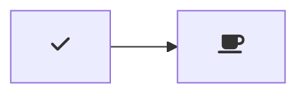

# Markdown Preview Mermaid Support

[](https://marketplace.visualstudio.com/items?itemName=bierner.markdown-mermaid)

Adds Mermaid diagram and flowchart support to VS Code's builtin markdown preview


## Usage

Create diagrams in markdown using `mermaid` fenced code blocks:

~~~markdown

~~~

You can also use `:::` blocks:

```markdown
::: mermaid
graph TD;
    A-->B;
    A-->C;
    B-->D;
    C-->D;
:::
```

## Mermaid

Currently supports Mermaid version 8.13.10.

## Add custom CSS support

You can use the built-in functionality to add custom CSS. More info can be found in the [markdown.styles documentation](https://code.visualstudio.com/Docs/languages/markdown#_using-your-own-css)

For example, add Font Awesome like this:

```
"markdown.styles": [
    "https://use.fontawesome.com/releases/v5.7.1/css/all.css"
]
```

Use it like this:

~~~markdown

~~~
