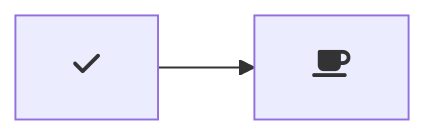

# Markdown Preview Mermaid Support

[](https://marketplace.visualstudio.com/items?itemName=bierner.markdown-mermaid)

Adds [Mermaid](https://mermaid-js.github.io/mermaid/#/) diagram and flowchart support to VS Code's builtin Markdown preview and to Markdown cells in notebooks.


Currently supports Mermaid version 9.4.0.

## Usage

Create diagrams in markdown using `mermaid` fenced code blocks:

~~~markdown

~~~

You can also use `:::` blocks:

```markdown
::: mermaid
graph TD;
    A-->B;
    A-->C;
    B-->D;
    C-->D;
:::
```


## Configuration

- `markdown-mermaid.lightModeTheme` — Configures the Mermaid theme used when VS Code is using a light color theme. Supported values are: `"base"`, `"forest"`, `"dark"`, `"default"`, `"neutral"`. Currently not supported in notebooks.

- `markdown-mermaid.darkModeTheme` — Configures the Mermaid theme used when VS Code is using a dark color theme. Supported values are: `"base"`, `"forest"`, `"dark"`, `"default"`, `"neutral"`. Currently not supported in notebooks.

- `markdown-mermaid.languages` — Configures language ids for Mermaid code blocks. The default is `["mermaid"]`.

- `markdown-mermaid.directives` — Configures directives and `themeVariables`. 
(See [directives](https://mermaid.js.org/config/directives.html), [themeVariables](https://mermaid.js.org/config/theming.html)).
Use `"debug": true` to display directives being sent to `mermaid.initialize()`.  When `themeVariables` is set, any theme is overridden with `"theme": "base"`.

Example (add to `setttings.json`):
```json
{
    "markdown-mermaid.directives": {
        "sequence": {
            "mirrorActors": false,
        },
        "themeVariables": {
            "primaryColor": "#BB2528",
            "primaryTextColor": "#fff",
            "primaryBorderColor": "#7C0000",
            "lineColor": "#F8B229",
            "secondaryColor": "#006100",
            "tertiaryColor": "#fff"
        },
        "debug": true,
    }
}
```


### Using custom CSS in the Markdown Preview

You can use the built-in functionality to add custom CSS. More info can be found in the [markdown.styles documentation](https://code.visualstudio.com/Docs/languages/markdown#_using-your-own-css)

For example, add Font Awesome like this:

```
"markdown.styles": [
    "https://use.fontawesome.com/releases/v5.7.1/css/all.css"
]
```

Use it like this:

~~~markdown

~~~
