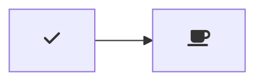

```mermaid
architecture-beta
    service user(mdi:account)
    service lambda(logos:aws-lambda)

    user:R --> L:lambda
```

# Markdown Preview Mermaid Support

[](https://marketplace.visualstudio.com/items?itemName=bierner.markdown-mermaid)

Adds [Mermaid](https://mermaid-js.github.io/mermaid/#/) diagram and flowchart support to VS Code's builtin Markdown preview and to Markdown cells in notebooks.


Currently supports Mermaid version 11.12.0.

## Usage

Create diagrams in markdown using `mermaid` fenced code blocks:

~~~markdown

~~~

You can also use `:::` blocks:

```markdown
::: mermaid
graph TD;
    A-->B;
    A-->C;
    B-->D;
    C-->D;
:::
```

Supports [MDI](https://icon-sets.iconify.design/mdi/) and [logos](https://icon-sets.iconify.design/logos/) icons from Iconify:

~~~markdown

~~~


## Navigating Diagrams

Mermaid diagrams support panning and zooming to help explore large or complex diagrams. By default, navigation controls appear when you hover over or focus on a diagram. You can also navigate diagrams using the mouse:

### Zooming
To zoom in and out of diagrams:

- **Zoom controls** — Use the `+` and `-` buttons that appear in the navigation controls
- **Scroll wheel** — Hold <kbd>alt</kbd> (<kbd>option</kbd> on Mac) and scroll to zoom
- **Pinch-to-zoom** — Use a trackpad pinch gesture
- **Click zoom** — Alt+click to zoom in, Alt+Shift+click to zoom out

To reset the zoom level and position, click the `reset` button in the controls.

### Panning
To pan around a diagram:

- **Click and drag** — Hold <kbd>alt</kbd> (<kbd>option</kbd> on Mac) and click and drag to pan
- **Pan mode** — Click the `pan mode` button in the navigation controls to enable click-and-drag panning without holding <kbd>alt</kbd>. Click it again to turn off `pan mode`.

By default, click-and-drag panning requires holding the <kbd>alt</kbd> key to prevent accidental panning. Use `markdown-mermaid.mouseNavigation.enabled` to change this:

- `always` — Click and drag always pans (no modifier key needed)
- `alt` — Click and drag only pans when holding <kbd>alt</kbd> (default)
- `never` — Disable mouse-based panning (controls and pinch-to-zoom still work)


## Configuration

### `markdown-mermaid.lightModeTheme`

Configures the Mermaid theme used when VS Code is using a light color theme. Supported values:

- `base`
- `forest`
- `dark`
- `default`
- `neutral`

Currently not supported in notebooks.

### `markdown-mermaid.darkModeTheme`

Configures the Mermaid theme used when VS Code is using a dark color theme. Supported values:

- `base`
- `forest`
- `dark`
- `default`
- `neutral`

Currently not supported in notebooks.

### `markdown-mermaid.languages`

Configures language ids used to identify Mermaid code blocks in markdown. The default is `["mermaid"]`.

### `markdown-mermaid.mouseNavigation.enabled`

Controls when mouse-based navigation (panning and zooming) is enabled. The default is `alt`. Supported values:

- `always` — Always enable mouse navigation on mermaid diagrams
- `alt` — Only enable mouse navigation when holding down <kbd>alt</kbd> (<kbd>option</kbd> on Mac)
- `never` — Disable mouse navigation

### `markdown-mermaid.controls.show`

When to show navigation control buttons. The default is `onHoverOrFocus`. Supported values:

- `never` — Never show navigation controls
- `onHoverOrFocus` — Show navigation controls when hovering over or focusing on a diagram
- `always` — Always show navigation controls

### `markdown-mermaid.maxTextSize`

Maximum allowed size of diagram text. The default is `50000`.


## Using custom CSS in the Markdown Preview

You can use the built-in functionality to add custom CSS. More info can be found in the [markdown.styles documentation](https://code.visualstudio.com/Docs/languages/markdown#_using-your-own-css)

For example, add Font Awesome like this:

```json
"markdown.styles": [
    "https://use.fontawesome.com/releases/v5.7.1/css/all.css"
]
```

Use it like this:

~~~markdown

~~~
