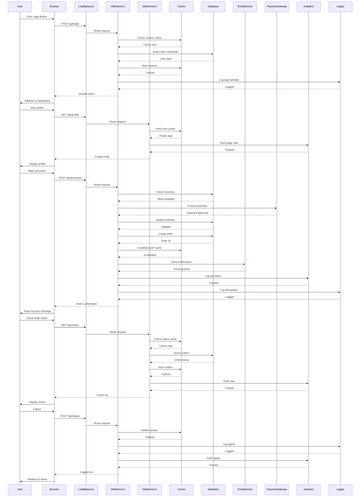

```mermaid
sequenceDiagram
    participant User
    participant Browser
    participant LoadBalancer
    participant WebServer1
    participant WebServer2
    participant Cache
    participant Database
    participant EmailService
    participant PaymentGateway
    participant Analytics
    participant Logger

    User->>Browser: Click Login Button
    Browser->>LoadBalancer: POST /api/login
    LoadBalancer->>WebServer1: Route request
    WebServer1->>Cache: Check session cache
    Cache-->>WebServer1: Cache miss
    WebServer1->>Database: Query user credentials
    Database-->>WebServer1: User data
    WebServer1->>Cache: Store session
    Cache-->>WebServer1: Cached
    WebServer1->>Logger: Log login attempt
    Logger-->>WebServer1: Logged
    WebServer1-->>Browser: Session token
    Browser->>User: Redirect to dashboard

    User->>Browser: View profile
    Browser->>LoadBalancer: GET /api/profile
    LoadBalancer->>WebServer2: Route request
    WebServer2->>Cache: Fetch user profile
    Cache-->>WebServer2: Profile data
    WebServer2->>Analytics: Track page view
    Analytics-->>WebServer2: Tracked
    WebServer2-->>Browser: Profile HTML
    Browser->>User: Display profile

    User->>Browser: Make purchase
    Browser->>LoadBalancer: POST /api/purchase
    LoadBalancer->>WebServer1: Route request
    WebServer1->>Database: Check inventory
    Database-->>WebServer1: Stock available
    WebServer1->>PaymentGateway: Process payment
    PaymentGateway-->>WebServer1: Payment approved
    WebServer1->>Database: Update inventory
    Database-->>WebServer1: Updated
    WebServer1->>Database: Create order
    Database-->>WebServer1: Order ID
    WebServer1->>Cache: Invalidate user cache
    Cache-->>WebServer1: Invalidated
    WebServer1->>EmailService: Send confirmation
    EmailService-->>WebServer1: Email queued
    WebServer1->>Analytics: Log purchase
    Analytics-->>WebServer1: Tracked
    WebServer1->>Logger: Log transaction
    Logger-->>WebServer1: Logged
    WebServer1-->>Browser: Order confirmation
    Browser->>User: Show success message

    User->>Browser: Check order status
    Browser->>LoadBalancer: GET /api/orders
    LoadBalancer->>WebServer2: Route request
    WebServer2->>Cache: Check orders cache
    Cache-->>WebServer2: Cache miss
    WebServer2->>Database: Query orders
    Database-->>WebServer2: Order history
    WebServer2->>Cache: Store orders
    Cache-->>WebServer2: Cached
    WebServer2->>Analytics: Track view
    Analytics-->>WebServer2: Tracked
    WebServer2-->>Browser: Orders list
    Browser->>User: Display orders

    User->>Browser: Logout
    Browser->>LoadBalancer: POST /api/logout
    LoadBalancer->>WebServer1: Route request
    WebServer1->>Cache: Delete session
    Cache-->>WebServer1: Deleted
    WebServer1->>Logger: Log logout
    Logger-->>WebServer1: Logged
    WebServer1->>Analytics: Track logout
    Analytics-->>WebServer1: Tracked
    WebServer1-->>Browser: Logged out
    Browser->>User: Redirect to home
```
