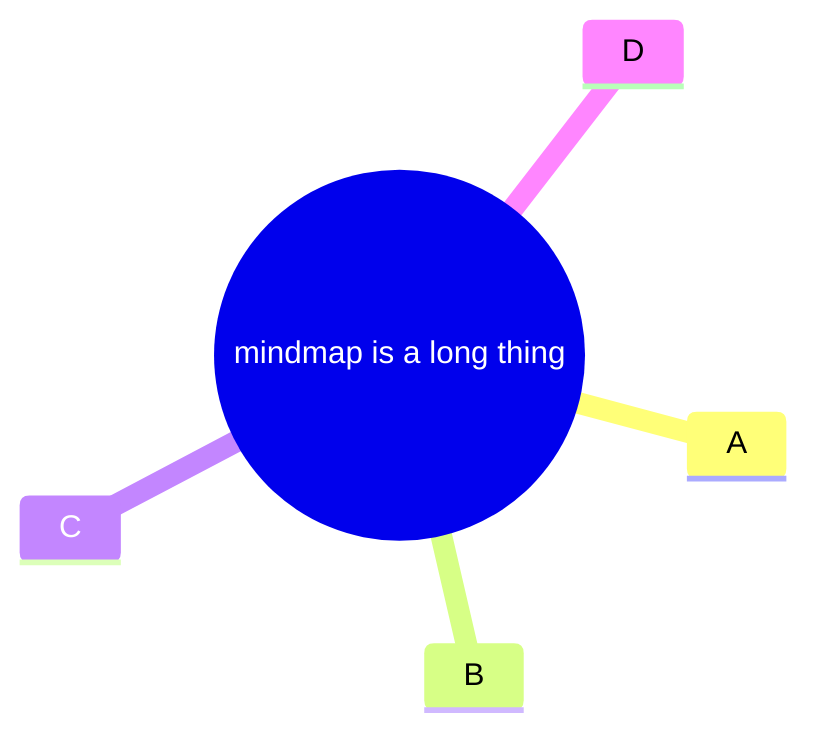

# Tidy tree layout engine

With:

```mermaid
---
config:
  layout: tidy-tree
---
mindmap
root((mindmap is a long thing))
  A
  B
  C
  D
```

Without:

```mermaid
mindmap
root((mindmap is a long thing))
  A
  B
  C
  D
```