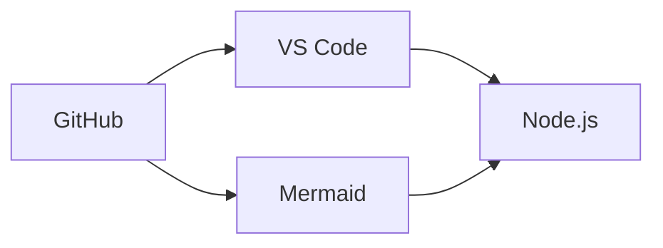

```mermaid
flowchart LR
    A[GitHub] --> B[VS Code]
    A --> C[Mermaid]
    B --> D[Node.js]
    C --> D
    
    click A "https://github.com" "Visit GitHub"
    click B "https://code.visualstudio.com" "Visit VS Code"
    click C "https://mermaid.js.org" "Visit Mermaid Docs"
    click D "https://nodejs.org" "Visit Node.js"
```
