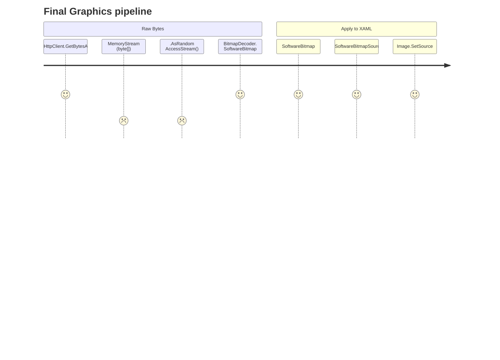

# Journey chart rendered too tall

https://github.com/mjbvz/vscode-markdown-mermaid/issues/344

```mermaid
journey
    title Final Graphics pipeline
    section Raw Bytes
        HttpClient.GetBytesAsync: 5
        MemoryStream (byte[]): 2
        .AsRandom AccessStream(): 2
        BitmapDecoder. SoftwareBitmap: 5
    section Apply to XAML
        SoftwareBitmap: 5
        SoftwareBitmapSource: 5
        Image.SetSource: 5
```

Should not have massive space above
